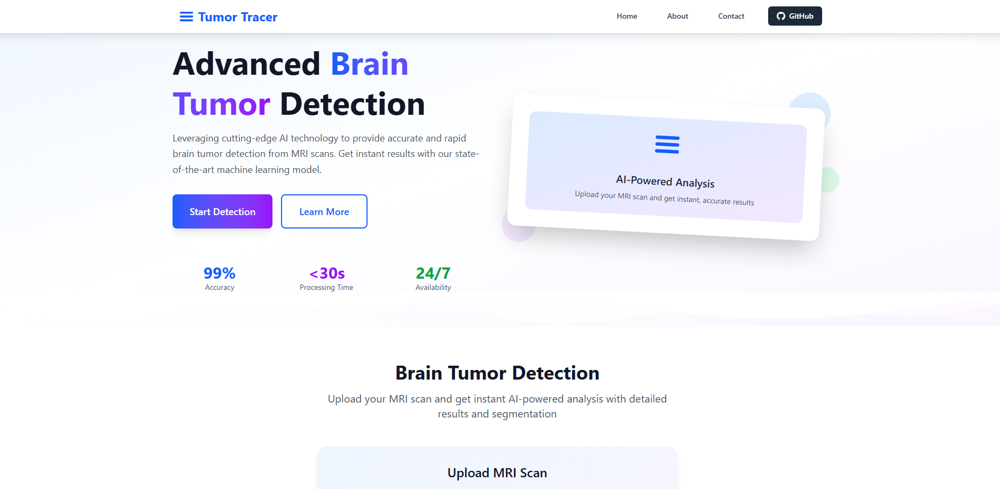

# Tumor Tracer

**Tumor Tracer** is a modern, responsive web application for advanced AI-powered brain tumor detection from MRI scans. Built with React and Tailwind CSS, it provides a seamless user experience and connects to a HuggingFace-hosted machine learning model for instant, accurate analysis and segmentation.

## Features

- **AI-Powered Detection:** Upload brain MRI scans and receive rapid, detailed tumor analysis and segmentation.
- **Lightning Fast:** Results in under 30 seconds, powered by optimized deep learning models.
- **High Accuracy:** 99%+ accuracy rate using state-of-the-art computer vision and medical imaging techniques.
- **User-Friendly:** Simple drag-and-drop interface, mobile-optimized, and touch-friendly.
- **Secure & Private:** Your data is processed securely and never stored permanently.
- **24/7 Availability:** Cloud-based, always-on service.
- **Modern UI/UX:** Beautiful, professional design with pixel-perfect alignment, smooth animations, and a floating scroll-to-top button for easy navigation.
- **Open Source:** Easily extensible and customizable for research or clinical use.

## Screenshot



## Getting Started

### Prerequisites

- Node.js (v18+ recommended)
- npm
- Python 3.8+

### Installation (Frontend)

1. **Clone the repository:**
   ```bash
   git clone https://github.com/ItsEragon/TumorTracer.git
   cd TumorTracer
   ```

2. **Install dependencies:**
   ```bash
   npm install
   ```

3. **Start the development server:**
   ```bash
   npm run dev
   ```

4. Open [http://localhost:5173](http://localhost:5173) in your browser.

### Backend Setup (Local API)

The backend is a FastAPI app for brain tumor detection and segmentation. You can run it locally for development or deploy it to a server/cloud.

1. **Install Python dependencies:**
   ```bash
   cd backend
   pip install -r requirements.txt
   ```

2. **Run the API server:**
   ```bash
   uvicorn app.main:app --host 0.0.0.0 --port 8000
   ```

   The API will be available at [http://localhost:8000](http://localhost:8000). The prediction endpoint is `/predict/`.

> **Note:** The model weights file (`tumor_segmentation_model.pth`) must be present in the `backend/` directory.

3. **(Optional) Run with Docker:**
   ```bash
   cd backend
   docker build -t tumor-tracer-backend .
   docker run -p 8000:8000 tumor-tracer-backend
   ```

### Build for Production

```bash
npm run build
```

### Preview Production Build

```bash
npm run preview
```

## Usage

1. **Upload an MRI Scan:**  
   Drag and drop your MRI image or click to browse and select a file.
2. **Analyze:**  
   Click "Analyze MRI Scan" to send the image to the AI model.
3. **View Results:**  
   Instantly see tumor detection results and segmentation overlays.

> **Note:** The app connects to a HuggingFace Spaces API for inference. Ensure you have a stable internet connection.

## Project Structure

```
backend/
  app/
    main.py            # FastAPI app
    model.py           # Model loading and prediction logic
  Dockerfile           # For containerized deployment
  requirements.txt     # Python dependencies
  tumor_segmentation_model.pth # Model weights (required)
  README.md            # Backend-specific info
src/
  components/          # React components (Header, Hero, DetectionSection, About, Contact, Footer, ScrollToTopButton)
  assets/              # Static assets
  index.css            # Tailwind and custom styles
  main.jsx             # App entry point
public/
  favicon.png          # App icon
  favicon.svg          # SVG icon
  vite.svg             # Vite logo
index.html             # Main HTML file
tailwind.config.js     # Tailwind configuration
vite.config.js         # Vite configuration
```

## Customization

- **Branding:** Update the logo and colors in `Header.jsx` and `tailwind.config.js`.
- **API Endpoint:** The detection API is set in `DetectionSection.jsx` (`https://itseragon-brain-tumor-api.hf.space/predict/`). Change this if you deploy your own model.
- **Social Links:** Update your GitHub, LinkedIn, and Twitter in `Contact.jsx`.

## Contributing

Contributions are welcome! Please open issues or pull requests for improvements or bug fixes.

### Linting

This project uses ESLint with React and Tailwind best practices:

```bash
npm run lint
```

## License

[MIT](LICENSE) © Tumor Tracer

## Contact

Connect with us:

- [LinkedIn](https://linkedin.com/in/itseragon)
- [GitHub](https://github.com/ItsEragon)
- [Twitter](https://x.com/reek312)

## Backend

The backend is a FastAPI-based REST API for brain tumor detection and segmentation. It loads a PyTorch model and exposes a `/predict/` endpoint that accepts MRI images and returns tumor segmentation results (including a mask and overlay as base64 images).

- **Tech stack:** FastAPI, PyTorch, segmentation-models-pytorch, OpenCV, Pillow
- **Entry point:** `backend/app/main.py`
- **Model weights:** `backend/tumor_segmentation_model.pth`
- **Install dependencies:** `pip install -r requirements.txt`
- **Run locally:** `uvicorn app.main:app --host 0.0.0.0 --port 8000`
- **Docker support:** See `backend/Dockerfile`

The frontend connects to this backend via the `/predict/` endpoint. You can change the API URL in `src/components/DetectionSection.jsx` if self-hosting.
